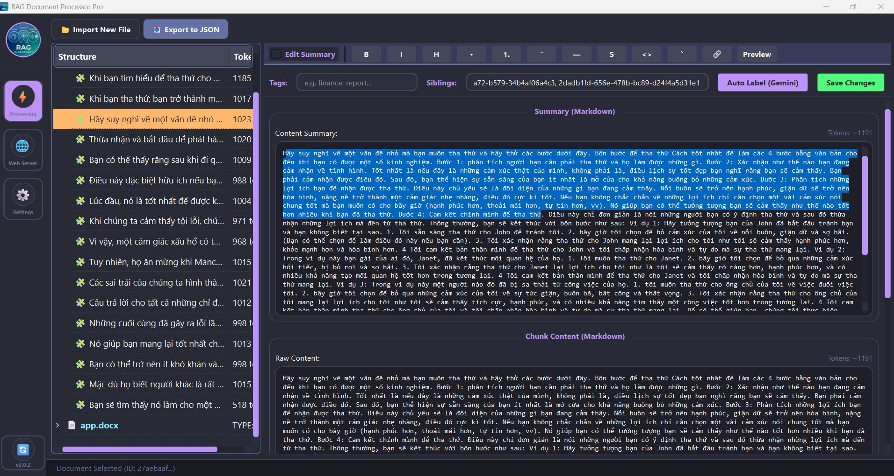
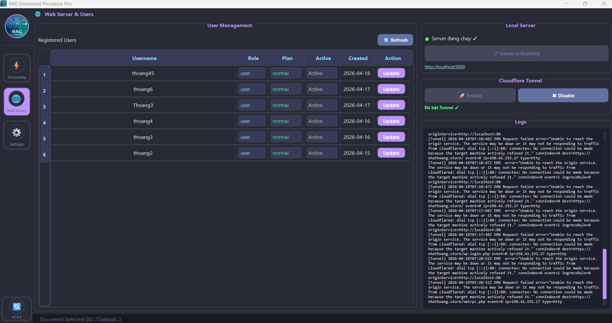
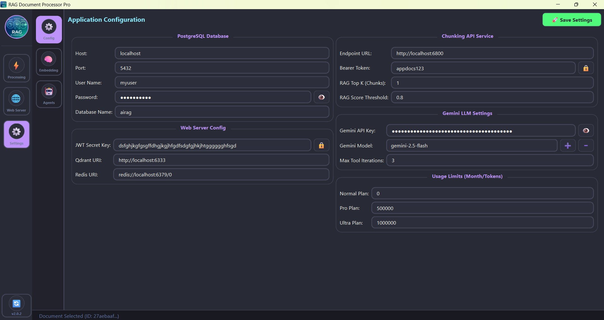
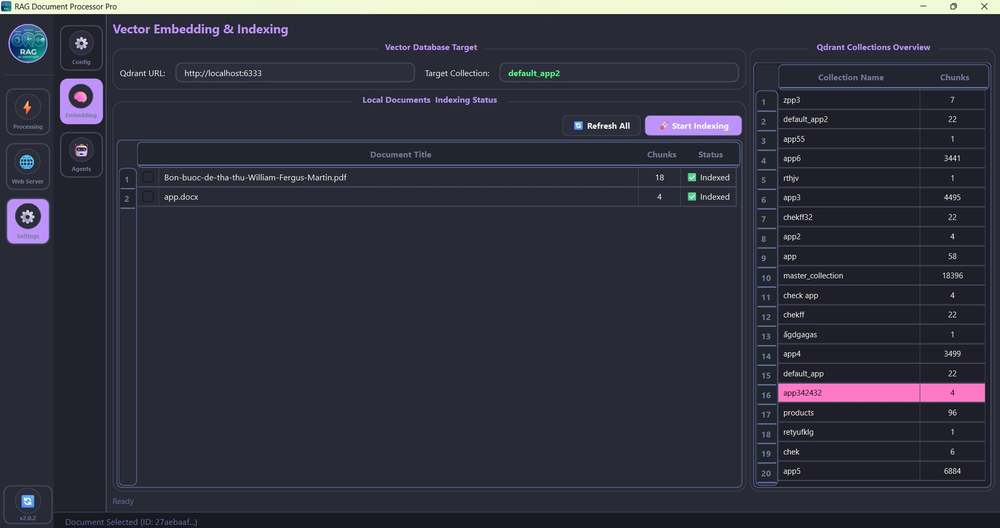
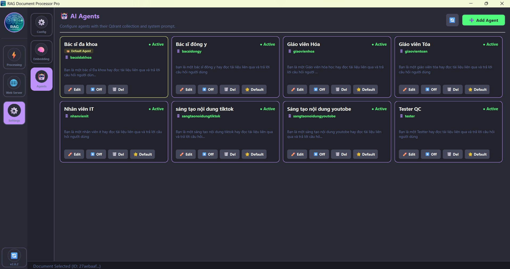

# Rag Document Pro - Hướng dẫn cài đặt từ A-Z

Tài liệu này hướng dẫn bạn các bước thiết lập từ lúc clone dự án cho đến khi khởi chạy ứng dụng hoàn chỉnh.

---

## 1. Chuẩn bị ban đầu (Clone Project)

Đầu tiên, bạn cần clone project này về máy hoặc Server:

```bash
git clone https://github.com/NhoThoang/Rag_doccument_pro.git
cd Rag_doccument_pro
```

---

## 2. Hướng dẫn chạy trên WSL (Windows Subsystem for Linux)

### 2.1. Cập nhật hệ thống và cài đặt công cụ
Mở terminal WSL của bạn và chạy các lệnh sau:

```bash
# Cập nhật danh sách gói
sudo apt update

# Cài đặt công cụ 'make'
sudo apt install make -y
```

### 2.2. Cài đặt Docker và Docker Compose
Sử dụng Makefile để tự động cài đặt môi trường:

```bash
make install
```
**LƯU Ý QUAN TRỌNG:** Sau khi cài xong, bạn **BẮT BUỘC** phải đóng Terminal WSL và mở lại, hoặc chạy lệnh `newgrp docker` để quyền truy cập Docker có hiệu lực ngay lập tức mà không cần khởi động lại session.

### 2.3. Cấu hình và Khởi chạy

> [!IMPORTANT]
> **TRƯỚC KHI CHẠY (UP):** Bạn nên mở file `config_docker_compose/postgree.env` để kiểm tra hoặc thay đổi thông tin Database (User, Password, DB Name) nếu cần thiết.

#### Bước 2.3.1: Tạo Network và Run dịch vụ
```bash
# Tạo network cho ứng dụng
make network

# Khởi chạy toàn bộ dịch vụ (Postgres, Redis, Qdrant, Minio, v.v.)
make up
```

### 2.4. Các lệnh quản lý nhanh
*   **Trạng thái container:** `make ps`
*   **Xem logs:** `make logs`
*   **Dừng ứng dụng:** `make down`
*   **Khởi động lại:** `make restart`

---

## 3. Cài đặt và Kết nối Ứng dụng (Client)

Sau khi hệ thống phía Server đã chạy (`make up` thành công), bạn tiến hành cài đặt giao diện người dùng:

1.  **Tải ứng dụng tại đây:**
    *   **Windows:** [Install_rag_documents.exe (v1.0.1)](https://github.com/NhoThoang/Rag_doccument_pro/releases/download/v1.0.1/Install_rag_documents.exe)
    *   **macOS:** [Rag_documents-macos-latest.zip](https://github.com/NhoThoang/Rag_doccument_pro/releases/download/untagged-99b65f73734e5e2db274/Rag_documents-macos-latest.zip)
    *   **Ubuntu:** [Rag_documents-ubuntu-latest.zip](https://github.com/NhoThoang/Rag_doccument_pro/releases/download/untagged-99b65f73734e5e2db274/Rag_documents-ubuntu-latest.zip)

2.  **Hướng dẫn khởi chạy (macOS & Ubuntu):**
    *   Tải file `.zip` tương ứng và giải nén.
    *   Mở file `config/db_config.json` và cấu hình các thông số Database (khớp với file `.env` phía Server):
        *   `host`, `port`, `user`, `password`, `database`.
    *   Chạy file thực thi `Rag_documents` (có thể cần cấp quyền thực thi: `chmod +x Rag_documents`).

3.  **Hướng dẫn khởi chạy (Windows):**
    *   Mở ứng dụng và điền các thông số kết nối trực tiếp trên giao diện:
        *   **POSTGRES_DB:** `dongybiphap`
        *   **POSTGRES_USER:** `dongybiphap`
        *   **POSTGRES_PASSWORD:** `kmhd16061994`
        *   **POSTGRES_HOST:** `localhost` (hoặc IP server/WSL của bạn)
        *   **POSTGRES_PORT:** `5432`
    *   Bấm **Connect** để ứng dụng tiến hành kết nối, cài đặt và khởi tạo các bảng dữ liệu cần thiết.

---

## 4. Giao diện ứng dụng (Screenshots)

Dưới đây là một số hình ảnh thực tế của ứng dụng:

### 4.1. Quản lý và Chunk tài liệu
*Ảnh 1: Giao diện chọn tài liệu để tiến hành xử lý chunking.*


### 4.2. Quản lý User và Server
*Ảnh 2: Giao diện quản lý người dùng, trạng thái server và bật/tắt Cloudflare Tunnel.*


### 4.3. Cấu hình hệ thống (Settings)
*Ảnh 3: Các thiết lập chung cho toàn bộ ứng dụng.*


### 4.4. Xử lý Embedding
*Ảnh 4: Tiến trình Embedding các file đã được chunk ở Bước 4.1.*


### 4.5. Thiết lập AI Agents
*Ảnh 5: Các tùy chỉnh và thiết lập cho AI Agent.*


---
*Chúc bạn cài đặt thành công!*
